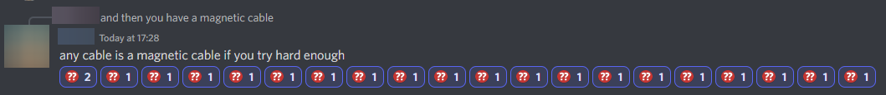
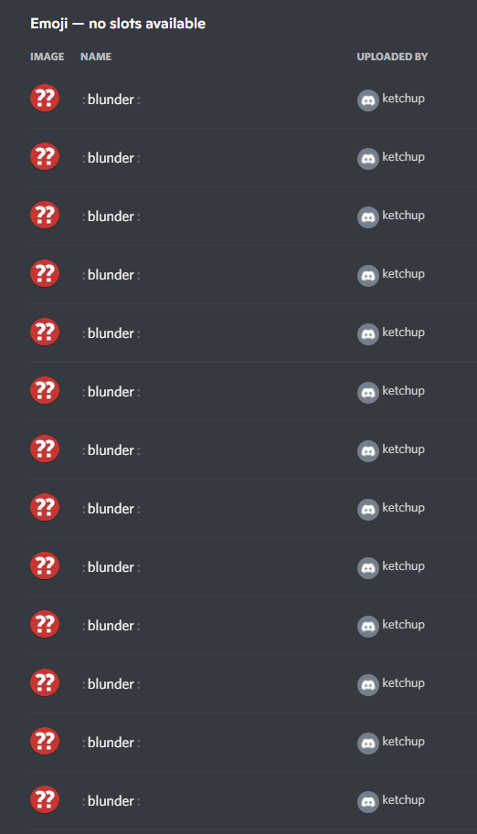
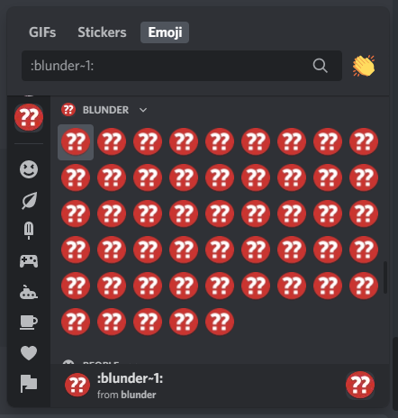

# discord-emoji-server
For when one emoji isn't enough

## What
This is a small discord bot that allows you to mass-add multiple copies of the same emoji to a server.

Having those can be useful when adding reactions to a message. Observe:



This bot uses slash commands.
At its core, you can copy an existing emoji (from somewhere else) into the current server like this:
```
/emoji add <:existing_emoji:>
```
That command also supports two optional arguments:

* `name`: override the name your newly created emoji will get (default: use original name). Note that multiple server emoji can have the same name
* `count`: how many copies of the emoji to add (default: 1). The max is 50 for non-boosted servers

If you ever change your mind, you can delete all emojis with a certain name using:
```
/emoji remove <name>
```
(it even has autocomplete, woop woop)

## Why
I'm not spending 5 minutes manually adding emoji when I can also spend 2 hours writing a bot that does it for me.

<details>
<summary>click to expand for some screenshots of the resulting discord server</summary>



</details>

## How
1. create a discord bot in the [discord dev portal](https://discord.com/developers/applications)
2. invite the bot to your target guild. make sure it has `application.commands` (and `bot`, duh). also needs manage emoji or admin perms, double duh.
3. install pip packages from `requirements.txt`
4. put the bot's token into the environment variable `DISCORD_TOKEN`
5. put a comma-separated list of guild ids you want this bot to work in into the environment variable `GUILD_IDS`
6. run `main.py`

Note that this doesn't have any permission checks whatsoever. _anyone can run the `/emoji` command!_